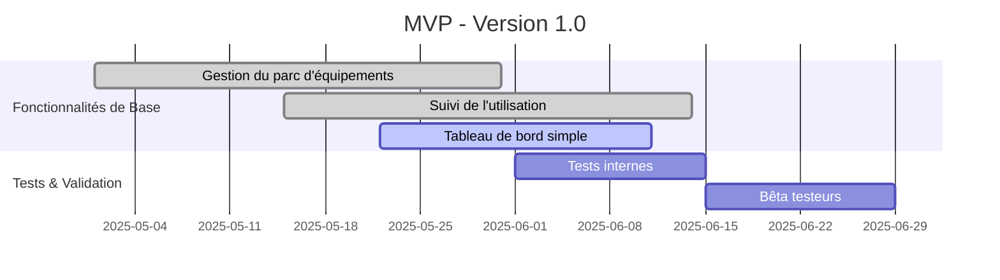

<div align="center">

# 📋 Spécifications du Produit - MVP

**EduTrack Mini**  
*Suivi des Équipements Éducatifs*

*Rédigé par Pierre De Dobbeleer*  
*Dernière mise à jour : 21 mai 2025*  
*Version du document : 2.0*

---
</div>

## 📌 Sommaire Exécutif

### 1. Vue d'Ensemble

EduTrack Mini est une solution légère et intuitive pour le suivi de l'utilisation des équipements éducatifs dans les établissements scolaires. Développée avec Flask et SQLite, elle permet de gérer efficacement le parc matériel en se concentrant sur le suivi d'utilisation des équipements fixes.

### 💡 Points Clés
- **Public Cible** : Établissements d'enseignement en Fédération Wallonie-Bruxelles
- **Périmètre** : Suivi de l'utilisation des équipements fixes
- **Délai** : MVP pour Septembre 2025
- **Équipe** : 1 développeur (temps partiel) + support techno-pédagogique

### 🚀 Avantages Clés
1. **Simplicité** : Interface intuitive et légère
2. **Facilité de déploiement** : Fonctionne sur Raspberry Pi ou PC existant
3. **Suivi précis** : Enregistrement fiable de l'utilisation des équipements
4. **Conforme RGPD** : Protection des données utilisateurs
5. **Maintenance réduite** : Mises à jour trimestrielles

### 📈 Indicateurs de Succès
- Couverture de 90% des équipements ciblés
- Satisfaction utilisateur > 4.5/5
- Temps de formation < 30 minutes
- 100% de conformité RGPD
- Temps de résolution < 1 semaine pour les problèmes critiques

### 📞 Support
- Support par email : pierre@eafc-tic.be
- Documentation en ligne complète
- Mises à jour planifiées tous les 3 mois
- Correctifs critiques sous 1 semaine

---

## 📑 Table des Matières

1. [Vue d'Ensemble](#1-vue-densemble)
2. [Fonctionnalités du MVP](#2-fonctionnalités-du-mvp)
3. [Spécifications Techniques](#3-spécifications-techniques)
4. [Planning de Développement](#4-planning-de-développement)
5. [Support et Maintenance](#5-support-et-maintenance)
6. [Annexes](#6-annexes)

---

## 1. Vue d'Ensemble

### 1.1 Contexte
Les établissements scolaires doivent justifier l'utilisation des équipements subventionnés. Actuellement, ce suivi est souvent effectué manuellement, ce qui est chronophage et peu fiable.

### 1.2 Objectifs
- Permettre un suivi simple et fiable de l'utilisation des équipements
- Fournir des preuves d'utilisation pour les rapports de subventions
- Réduire la charge administrative liée au suivi des équipements
- Fonctionner sur du matériel existant (Raspberry Pi ou PC)

### 1.3 Public Cible
- Enseignants et formateurs
- Responsables de salles informatiques
- Administrateurs système
- Équipe de direction

## 2. Fonctionnalités du MVP

### 2.1 Fonctionnalités Principales
- **Gestion des Salles**
  - Ajout/édition/suppression des salles
  - Association des équipements aux salles

- **Suivi des Équipements**
  - Enregistrement de l'utilisation (début/fin)
  - Statut en temps réel (disponible/en cours d'utilisation)
  - Historique des utilisations

- **Rapports**
  - Export des données en CSV/Excel
  - Vue synthétique par période
  - Taux d'utilisation par équipement

### 2.2 Fonctionnalités Futures (Post-MVP)
- Tableau de bord avancé
- Notifications automatisées
- Gestion des utilisateurs avancée
- Intégration avec d'autres systèmes

## 3. Spécifications Techniques

### 3.1 Architecture
- **Frontend** : HTML5, CSS3, JavaScript (Vanilla)
- **Backend** : Python 3.8+ avec Flask
- **Base de données** : SQLite
- **Conteneurisation** : Docker
- **Orchestration** : Docker Compose

### 3.2 Hébergement
- **Conteneurs Docker** : Fonctionne sur tout système supportant Docker
- **Configuration minimale** :
  - 1 cœur CPU
  - 1 Go de RAM
  - 2 Go d'espace disque
- **Plateformes supportées** :
  - Raspberry Pi (modèle 3B+ ou supérieur)
  - PC/Server (Linux/Windows/macOS)
  - VPS/Cloud (AWS, OVH, etc.)

### 3.3 Sécurité
- Données stockées localement
- Sauvegardes automatiques
- Conforme au RGPD
- Accès protégé par mot de passe

## 4. Planning de Développement

### 4.1 Calendrier des Versions
- **Version 0.1** (Juin 2025) : Structure de base et modèles de données
- **Version 0.5** (Juillet 2025) : Interface utilisateur minimale
- **Version 0.9** (Août 2025) : Fonctionnalités complètes et tests
- **Version 1.0** (Septembre 2025) : Version de production

### 4.2 Livrables
- **Images Docker** prêtes à l'emploi
- Fichiers de configuration Docker Compose
- Documentation utilisateur
- Guide de déploiement avec Docker
- Scripts d'administration
- Exemples de configuration

## 5. Support et Maintenance

### 5.1 Déploiement avec Docker
- **Prérequis** :
  - Docker Engine 20.10+
  - Docker Compose 2.0+
- **Démarrage rapide** :
  ```bash
  docker-compose up -d
  ```
- **Variables d'environnement** :
  - `PORT` : Port d'écoute (défaut: 5000)
  - `DB_PATH` : Chemin de la base de données
  - `SECRET_KEY` : Clé secrète pour les sessions

### 5.2 Maintenance
- **Mises à jour** :
  ```bash
  docker-compose pull
  docker-compose up -d --build
  ```
- **Sauvegardes** :
  - Volume Docker pour les données
  - Scripts de sauvegarde inclus
  - Documentation pour la restauration

### 5.3 Support
- Support par email : pierre@eafc-tic.be
- Délai de réponse : 2 jours ouvrables
- Documentation en ligne complète

## 6. Annexes

### 6.1 Glossaire
- **MVP** : Minimum Viable Product (Produit Minimum Viable)
- **RGPD** : Règlement Général sur la Protection des Données
- **SQLite** : Système de gestion de base de données relationnelle

### 6.2 Références
- Documentation Flask
- Guide de développement Python
- Normes d'accessibilité RGAA

---

*Document créé le 21/05/2025 - Tous droits réservés*

### 1.7.1 Risques Identifiés
| Risque | Impact | Probabilité | Niveau | Mesures d'Atténuation |
|--------|--------|-------------|--------|----------------------|
| Résistance au changement | Élevé | Moyen | Élevé | Formation, accompagnement |
| Problèmes techniques | Critique | Faible | Moyen | Support réactif, documentation |
| Dépassement budgétaire | Moyen | Moyen | Moyen | Suivi rigoureux, revues régulières |
| Non-adoption | Critique | Faible | Élevé | Implication utilisateurs, démonstrations |

### 1.7.2 Plan de Gestion des Risques
- Identification continue des risques
- Évaluation trimestrielle
- Mise à jour des mesures d'atténuation
- Communication transparente avec les parties prenantes

## 2. Utilisateurs et Personas

### 2.1 Profils Utilisateurs

#### Enseignant (Utilisateur Principal)
- **Besoins** :
  - Accès rapide aux équipements disponibles
  - Processus de suivi simplifié
  - Notifications des mises à jour
- **Frustrations** :
  - Processus manuel chronophage
  - Manque de visibilité sur les disponibilités
  - Difficulté à planifier les activités

#### Responsable Informatique (Administrateur)
- **Besoins** :
  - Gestion centralisée du parc
  - Maintenance préventive
  - Rapports d'utilisation
- **Frustrations** :
  - Manque de données fiables
  - Difficulté à justifier les investissements
  - Gestion des pannes réactive

#### Direction d'Établissement (Décideur)
- **Besoins** :
  - ROI clair
  - Conformité réglementaire
  - Optimisation des coûts
- **Frustrations** :
  - Manque de visibilité sur l'utilisation
  - Difficulté à planifier les renouvellements
  - Coûts cachés de gestion

  - Localisation (bâtiment, étage, salle)
  - Statut (opérationnel/en maintenance/hors service)
  - Date d'installation et de dernier contrôle
  - Horaires d'utilisation

### 4.2 Rapports et Statistiques
- **Données collectées** :
  - Taux d'utilisation par équipement
  - Temps d'utilisation quotidien/mensuel
  - Périodes de pointe d'utilisation
  - Historique des pannes

### 4.3 Maintenance
- **Planification** :
  - Calendrier des maintenances préventives
  - Alertes pour les contrôles périodiques
  - Suivi des interventions
  - Historique des réparations

### 4.2 Performance
- Temps de chargement des pages < 2 secondes
- Support de 100 utilisateurs simultanés
- Temps de réponse API < 200ms

### 4.3 Sécurité
- Authentification JWT
- Chiffrement TLS 1.3
- Protection CSRF
- Validation des entrées utilisateur

### 4.4 Données
- Sauvegarde automatique quotidienne
- Chiffrement AES-256 au repos
- Archivage automatique après 1 an

### 4.5 Accessibilité
- Conforme WCAG 2.1 AA
- Navigation au clavier
- Contraste minimum 4.5:1
- Alternatives textuelles

## 5. Exigences Fonctionnelles

### 5.1 Gestion des Équipements
- **Ajout/Modification**
  - Formulaire détaillé avec champs personnalisables
  - Import/Export CSV/Excel
  - Gestion des pièces jointes (factures, manuels)

### 5.2 Suivi d'Utilisation
- **Workflow complet**
  - Enregistrement des utilisations
  - Suivi en temps réel
  - Notifications automatiques
  - État des équipements

### 5.3 Tableaux de Bord
- **Vue globale**
  - État du parc
  - Taux d'utilisation
  - Alertes et maintenances
  - Indicateurs clés

### 5.4 Rapports
- **Types de rapports**
  - Utilisation par équipement
  - Historique des utilisations
  - Coûts de maintenance
  - Taux de disponibilité
  - Fréquence d'utilisation

### 5.5 Administration
- **Gestion des utilisateurs**
  - Rôles et permissions
  - Groupes et départements
  - Journal d'audit

### 5.6 Intégrations
- **Systèmes d'authentification**
  - LDAP/Active Directory
  - SSO (SAML 2.0, OAuth 2.0)
  - FranceConnect Éducation

- **Systèmes de Gestion Scolaire**
  - ENT (Espace Numérique de Travail)
  - Logiciels de vie scolaire
  - Systèmes de réservation de salles

- **Outils de Communication**
  - Emails transactionnels
  - Notifications push
  - Messagerie interne

- **API et Connecteurs**
  - API REST complète
  - Webhooks pour les événements
  - Documentation Swagger/OpenAPI

## 6. Planning & Méthodologie

### 6.1 Méthodologie Agile

#### Principes Clés
- **Approche itérative** : Développement par incréments de 2 semaines
- **Livraison continue** : Intégration et déploiement continus
- **Adaptabilité** : Réévaluation régulière des priorités
- **Collaboration** : Travail en étroite collaboration avec les parties prenantes

#### Rôles
- **Product Owner** : Définit les priorités et valide les fonctionnalités
- **Scrum Master** : Facilite le processus et supprime les obstacles
- **Équipe de Développement** : Conçoit, développe et teste les fonctionnalités
- **Utilisateurs Clés** : Fournissent des retours réguliers

#### Cérémonies
1. **Planification de Sprint (2h/sprint)**
   - Revue du backlog priorisé
   - Définition des objectifs du sprint
   - Estimation des tâches (planning poker)

2. **Daily Stand-up (15 min/jour)**
   - Avancement depuis la dernière réunion
   - Objectifs du jour
   - Blocages éventuels

3. **Revue de Sprint (1h/sprint)**
   - Démonstration des fonctionnalités terminées
   - Retours des parties prenantes
   - Ajustement du backlog

4. **Rétrospective (1h/sprint)**
   - Ce qui a bien fonctionné
   - Points d'amélioration
   - Plan d'action concret

#### Outils
- **Gestion de Projet** : Jira avec tableaux Kanban
- **Documentation** : Confluence avec modèles standardisés
- **Versioning** : Git avec GitFlow
- **CI/CD** : GitHub Actions avec pipelines automatisés
- **Communication** : Slack pour la communication asynchrone

### 6.2 Feuille de Route Produit

#### Contexte du Projet
EduTrack Mini est développé dans le cadre d'un projet européen supervisé par WBE (Wallonie-Bruxelles Enseignement) et est spécifiquement conçu pour les écoles de promotion sociale. La solution pourra être réutilisée dans d'autres établissements scolaires sur demande.

#### Phase 1 : MVP (Mai - Juin 2025)


#### Phase 2 : Améliorations (Juillet - Août 2025)
- **V1.1 - Juillet 2025**
  - Rapports d'utilisation avancés
  - Gestion des utilisateurs avancée
  - Notifications automatisées
  
- **V1.2 - Août 2025**
  - API d'intégration WBE
  - Améliorations de l'interface utilisateur
  - Tableau de bord personnalisable

#### Phase 3 : Maturité (Septembre - Décembre 2025)
- **V1.3 - Septembre 2025**
  - Application mobile de consultation
  - Synchronisation des données en temps réel
  - Amélioration des performances

- **V1.4 - Novembre 2025**
  - Analyse des tendances d'utilisation
  - Gestion des maintenances préventives
  - Tableaux de bord directionnels

#### Métriques de Succès par Phase
| Phase | Objectif | Métrique | Cible |
|-------|----------|----------|-------|
| MVP | Lancement stable | Temps de disponibilité | >99.5% |
| V1.1 | Adoption | Établissements actifs | >70% |
| V1.2 | Intégration WBE | Nombre d'intégrations | >3 |
| V1.3 | Mobilité | Taux d'utilisation mobile | >40% |
| V1.4 | Satisfaction | Satisfaction utilisateur | >4.5/5 |

## 7. Sécurité & Conformité

## 7. Sécurité & Conformité

### 7.1 Gouvernance et Cadre Réglementaire

#### Désignation et Rôles
- **DPO (Délégué à la Protection des Données)**
  - Responsable de la conformité RGPD
  - Point de contact pour les autorités de contrôle
  - Veille réglementaire continue

- **RSSI (Responsable de la Sécurité des Systèmes d'Information)**
  - Définition de la politique de sécurité
  - Gestion des risques sécurité
  - Coordination des audits de sécurité

#### Documentation et Conformité
- **Registre des Traitements**
  - Cartographie complète des traitements
  - Finalités et bases légales
  - Flux de données internes et externes

- **Analyses d'Impact (PIA)**
  - Réalisation pour les traitements à risque
  - Documentation des mesures de protection
  - Validation par le DPO

#### Conformité Réglementaire
- **Réglementations**
  - RGPD (Règlement Général sur la Protection des Données)
  - ePrivacy (directive vie privée et communications électroniques)
  - LIL (Loi Informatique et Libertés)

- **Référentiels**
  - RGS (Référentiel Général de Sécurité)
  - SecNumCloud pour le cloud de confiance
  - HDS pour les données de santé

- **Revue et Mise à Jour**
  - Politique de sécurité documentée
  - Révision trimestrielle
  - Adaptation aux évolutions réglementaires

### 7.2 Architecture de Sécurité Technique

#### Chiffrement des Données
- **En Transit**
  - Protocole TLS 1.3 obligatoire
  - Configuration sécurisée (HSTS, CAA, etc.)
  - Renouvellement automatique des certificats

- **Au Repos**
  - Algorithme AES-256
  - Gestion des clés via HSM ou AWS KMS
  - Rotation régulière des clés

#### Authentification & Autorisation
- **Authentification Forte**
  - MFA/2FA obligatoire pour les accès sensibles
  - Limitation des tentatives de connexion
  - Journalisation complète des accès

- **Gestion des Accès**
  - RBAC (Role-Based Access Control)
  - Principe du moindre privilège
  - Révision trimestrielle des habilitations

#### Protection des Données
- **Confidentialité**
  - Pseudonymisation des données sensibles
  - Masquage dynamique des données
  - Journalisation des accès aux données critiques

- **Sauvegarde**
  - Sauvegardes chiffrées
  - Incrémentielles horaires
  - Complètes quotidiennes

#### Résilience
- **Plan de Reprise d'Activité (PRA)**
  - Tests annuels
  - Délai de reprise défini
  - Procédures documentées

- **Plan de Continuité d'Activité (PCA)**
  - Validation annuelle
  - Scénarios de crise
  - Mise à jour post-test

### 7.3 Gestion des Incidents de Sécurité

#### Détection et Signalement
- **Surveillance Continue**
  - Monitoring 24/7
  - Détection des anomalies
  - Alertes temps réel

- **Signalement**
  - Procédure de remontée
  - Canaux sécurisés
  - Délais définis

#### Traitement des Incidents
- **Réponse**
  - Analyse immédiate
  - Confinement de l'incident
  - Éradication de la menace

- **Notification**
  - CNIL sous 72h si violation
  - Personnes concernées si nécessaire
  - Communication adaptée

- **Amélioration Continue**
  - Revue post-incident
  - Mise à jour des procédures
  - Formation des équipes

### 7.4 Sous-traitance et Hébergement

#### Infrastructure
- **Localisation**
  - Zones géographiques : UE/FR
  - Périmètre de sécurité physique
  - Redondance des systèmes

- **Certifications**
  - ISO 27001
  - HDS pour les données de santé
  - SecNumCloud
  - Disponibilité 99,9%

#### Gestion des Sous-traitants
- **Sélection**
  - Audit préalable
  - Contrat type
  - Clauses RGPD

- **Surveillance**
  - Audits annuels
  - Respect des engagements
  - Gestion des sous-traitants en cascade

### 7.5 Preuves de Conformité et Audits

#### Programme d'Audit
- **Interne**
  - Audits trimestriels
  - Tests d'intrusion
  - Revues de code

- **Externe**
  - Audit annuel indépendant
  - Certification ISO 27001
  - Évaluations de conformité

#### Traçabilité
- **Journalisation**
  - Conservation 1 an
  - Analyse automatisée
  - Détection des anomalies

- **Documentation**
  - Politiques de sécurité
  - Procédures opérationnelles
  - Rapports d'audit
- **Procédure**
  - Détection et signalement
  - Analyse et confinement
  - Éradication et récupération
  - Revue post-incident

- **Notification**
  - Délai maximal de 72h pour les violations de données
  - Communication claire aux personnes concernées
  - Coordination avec la CNIL si nécessaire

## 8. Références & Ressources

### 8.1 Documentation

#### Technique
- [Documentation de l'API](https://api.edutrack-pro.fr/docs) - Référence complète des endpoints
- [Guide d'Architecture](https://docs.edutrack-pro.fr/architecture) - Vue d'ensemble technique
- [Manuel d'Installation](https://docs.edutrack-pro.fr/installation) - Procédures de déploiement
- [Guide de Sécurité](https://docs.edutrack-pro.fr/security) - Bonnes pratiques et configuration

#### Utilisateur
- [Guide de Démarrage Rapide](https://docs.edutrack-pro.fr/quickstart)
- [Manuel d'Utilisation](https://docs.edutrack-pro.fr/user-guide)
- [FAQ](https://docs.edutrack-pro.fr/faq)
- [Tutoriels Vidéo](https://youtube.com/edutrack-pro)

### 8.2 Support & Assistance

#### Canaux de Support
- **Support Technique**
  - Email : tbd

#### Niveaux de Support
| Niveau | Temps de Réponse | Canal | Couverture |
|--------|------------------|-------|------------|
| Critique | < 1h | Téléphone | 24/7 |
| Élevé | < 4h | Email | 8h-20h |
| Standard | < 24h | Ticket | Jours ouvrables |

#### Ressources Communautaires
tbd

### 8.3 Formation
- **Formation en Ligne**
  - Parcours utilisateur (1h)
  - Formation administrateur (2h)
  - Ateliers avancés (sur demande)

- **Framework** : HTML5, CSS3, JavaScript (Vanilla + Tailwind CSS)
- **Compatibilité** : Dernières versions de Chrome, Firefox, Safari, Edge
- **Responsive** : Adaptation aux tablettes et ordinateurs de bureau

#### Backend
- **Langage** : Python 3.8+
- **Framework** : Flask
- **API** : RESTful

#### Base de Données
- **Type** : Fichiers JSON (pour la version 1.0)
- **Structure** : 
  - equipments.json : Liste des équipements
  - users.json : Comptes utilisateurs
  

#### Sécurité
- **Authentification** : Simple avec nom d'utilisateur/mot de passe
- **Données** : Chiffrement des données sensibles
- **Sauvegarde** : Sauvegarde automatique quotidienne

#### Hébergement
- **Type** : Solution auto-hébergée
- **Systèmes d'exploitation** : Windows, macOS, Linux
- **Stockage** : 100 Mo d'espace disque minimum

#### Performance
- **Utilisateurs simultanés** : Jusqu'à 50 utilisateurs simultanés
- **Temps de réponse** : Moins de 2 secondes pour les opérations courantes

## 4. Détail des User Stories

### 4.1 Épiques

#### Gestion des Équipements
**Description** : Fonctionnalités liées à la gestion du parc d'équipements

**User Stories** :
1. **En tant qu'** administrateur, **je veux** ajouter un nouvel équipement avec ses détails **afin de** le rendre disponible pour le suivi
   - Critères d'acceptation :
     - Formulaire avec champs : nom, numéro de série, date d'acquisition, état, localisation
     - Génération automatique d'un QR code unique
     - Enregistrement dans la base de données

2. **En tant qu'** enseignant, **je veux** voir la liste des équipements disponibles **afin de** savoir ce que je peux utiliser
   - Critères d'acceptation :
     - Liste triable et filtrable
     - Indication claire de la disponibilité
     - Détails complets au survol ou clic

#### Utilisation des Équipements
**Description** : Processus de suivi d'utilisation des équipements

**User Stories** :
3. **En tant qu'** enseignant, **je veux** pouvoir enregistrer l'utilisation d'un équipement en scannant son QR code **afin de** gagner du temps
   - Critères d'acceptation :
     - Accès rapide au scanner via l'interface
     - Confirmation visuelle de l'enregistrement
     - Enregistrement automatique de l'heure et de l'utilisateur

4. **En tant qu'** administrateur, **je veux** recevoir une alerte pour les équipements non utilisés **afin de** optimiser leur utilisation
   - Critères d'acceptation :
     - Notification dans l'interface
     - Option pour envoyer un rappel par email
     - Historique des retards par utilisateur

#### Tableau de Bord et Rapports
**Description** : Visualisation des données d'utilisation

**User Stories** :
5. **En tant que** directeur, **je veux** voir un tableau de bord avec les statistiques d'utilisation **afin de** prendre des décisions éclairées
   - Critères d'acceptation :
     - Graphiques d'utilisation par période
     - Taux d'utilisation par équipement
     - Export des données en un clic

#### Gestion des Utilisateurs
**Description** : Gestion des comptes et des droits d'accès

**User Stories** :
6. **En tant qu'** administrateur, **je veux** pouvoir créer des comptes utilisateurs avec différents niveaux d'accès **afin de** contrôler les permissions
   - Critères d'acceptation :
     - Rôles définis : Admin, Enseignant, Lecture seule
     - Interface de gestion des utilisateurs
     - Journal des actions sensibles

### 4.2 Critères d'Acceptation Généraux
- L'interface doit être intuitive et nécessiter moins de 30 minutes de formation
- Le système doit pouvoir gérer jusqu'à 200 équipements sans ralentissement
- Les données doivent être sauvegardées automatiquement
- L'application doit fonctionner hors ligne avec synchronisation lors de la reconnexion (fonctionnalité future)

### 4.3 Contraintes Techniques
- Compatible avec les navigateurs récents (moins de 2 versions)
- Temps de chargement inférieur à 3 secondes
- Interface adaptative pour tablette et ordinateur
- Documentation utilisateur complète

### 4.4 Métriques de Succès
- Réduction de 50% du temps passé à gérer le suivi
- Moins de 5% d'erreurs dans le suivi des équipements
- Satisfaction utilisateur moyenne supérieure à 4/5
- 90% des enseignants utilisant régulièrement le système après 3 mois

## 5. Contraintes et Dépendances

### 5.1 Contraintes Techniques
- **Compatibilité** : Doit fonctionner sur les navigateurs récents (Chrome, Firefox, Safari, Edge)
- **Performance** : Temps de réponse inférieur à 2 secondes pour les opérations courantes
- **Stockage** : Utilisation minimale de l'espace disque (moins de 100 Mo pour 200 équipements)
- **Sécurité** : Protection des données utilisateur et conformité RGPD
- **Maintenance** : Mises à jour logicielles minimales requises

### 5.2 Dépendances Logicielles
- **Backend** : Python 3.8+, Flask, Bibliothèques de génération de QR codes
- **Frontend** : Navigateur web moderne, JavaScript (ES6+), Tailwind CSS
- **Système** : Accès au système de fichiers pour le stockage local
- **Réseau** : Connexion internet pour les mises à jour (optionnelle pour le fonctionnement de base)

### 5.3 Contraintes Métier
- **Formation** : Maximum 1 heure de formation par utilisateur
- **Support** : Documentation en ligne et support par email
- **Évolutivité** : Doit pouvoir gérer jusqu'à 200 équipements
- **Coût** : Solution à faible coût de déploiement et de maintenance
## 6. Plan de Lancement

### 6.1 Phase de Développement (Mois 1-2)
- **Semaine 1-2** : Développement du MVP (fonctionnalités essentielles)
- **Semaine 3** : Tests internes et corrections
- **Semaine 4** : Version bêta avec un groupe pilote (5-10 utilisateurs)
- **Mois 2** : Itérations basées sur les retours et corrections

### 6.2 Phase de Déploiement (Mois 3)
- **Préparation** : Documentation utilisateur et formation
- **Déploiement** : Installation sur les postes utilisateurs
- **Formation** : Sessions de formation en présentiel et supports en ligne
- **Support** : Période de support renforcé (2 semaines)

### 6.3 Phase d'Évaluation (Mois 4-6)
- **Suivi** : Collecte des données d'utilisation et des retours
- **Amélioration** : Mises à jour mineures basées sur les retours
- **Évaluation** : Revue des métriques de succès après 3 mois

## 7. Maintenance et Évolutions

### 7.1 Maintenance
- **Corrective** : Correction des bugs critiques sous 48h
- **Évolutive** : Mises à jour mineures mensuelles
- **Sauvegarde** : Sauvegarde automatique quotidienne des données

### 7.2 Feuille de Route
- **T1 2024** : Version 1.0 avec les fonctionnalités essentielles
- **T2 2024** : Version 1.1 avec les fonctionnalités importantes
- **T3 2024** : Version 1.2 avec les fonctionnalités secondaires
- **T4 2024** : Version 2.0 avec l'application mobile (si justifié par la demande)

## 8. Glossaire
- **Équipement** : Matériel éducatif (vidéoprojecteur, ordinateur portable, etc.)
- **Utilisation** : Emploi d'un équipement par un utilisateur
- **QR Code** : Code-barres 2D utilisé pour identifier les équipements
- **Tableau de bord** : Interface de visualisation des données d'utilisation
- **Admin** : Utilisateur avec des droits d'administration complets
- **Enseignant** : Utilisateur standard pouvant utiliser le matériel

## 9. Références

### 📚 Documentation Technique
- [Documentation Flask](https://flask.palletsprojects.com/) - Framework web Python
- [Guide de style Python PEP 8](https://www.python.org/dev/peps/pep-0008/) - Standards de codage Python
- [Tailwind CSS](https://tailwindcss.com/docs) - Framework CSS utilitaire
- [SQLAlchemy Documentation](https://docs.sqlalchemy.org/) - ORM Python

### 🔒 Conformité et Sécurité
- [RGPD - CNIL](https://www.cnil.fr/) - Règlement sur la protection des données
- [OWASP Top 10](https://owasp.org/www-project-top-ten/) - Principales vulnérabilités web
- [Mozilla Developer Network](https://developer.mozilla.org/) - Documentation web complète

### 📊 Gestion de Projet
- [Méthode Agile](https://agilemanifesto.org/iso/fr/manifesto.html) - Principes Agile
- [GitHub Projects](https://docs.github.com/en/issues/planning-and-tracking-with-projects) - Suivi des tâches
- [Markdown Guide](https://www.markdownguide.org/) - Syntaxe Markdown

### 🎨 Design et UX
- [Figma Community](https://www.figma.com/community) - Ressources de design
- [Material Design](https://material.io/design) - Lignes directrices de design
- [Heroicons](https://heroicons.com/) - Bibliothèque d'icônes

### 📱 Technologie Mobile (Futur)
- [React Native](https://reactnative.dev/) - Développement d'applications mobiles
- [Expo](https://expo.dev/) - Outils pour React Native
- [Fastlane](https://fastlane.tools/) - Automatisation des déploiements mobiles

## 9.1 État Actuel du Projet

### 📊 Avancement Général
- [x] Cahier des charges finalisé
- [ ] Développement du MVP en cours
- [ ] Tests utilisateurs planifiés
- [ ] Déploiement initial

### 📅 Prochaines Livraisons
1. **Version 1.0 (MVP)** - Juillet 2024
   - Gestion de base des équipements
   - Suivi des utilisations
   - Tableau de bord simplifié

2. **Version 1.1** - Septembre 2024
   - Rapports avancés
   - Gestion des utilisateurs
   - Export des données

3. **Version 1.2** - Novembre 2024
   - Notifications
   - API d'intégration
   - Améliorations de l'interface

### 📋 Prochaines Étapes Immédiates
1. Validation du cahier des charges
2. Mise en place de l'environnement de développement
3. Démarrage du développement du MVP
4. Recrutement des utilisateurs tests

## 9.2 Analyse des Risques

### 🚨 Risques Identifiés

| Risque | Impact | Probabilité | Gravité | Mesures d'Atténuation |
|--------|--------|-------------|----------|-----------------------|
| Faible adoption par les utilisateurs | Élevé | Moyenne | Élevée | - Formation approfondie<br>- Interface intuitive<br>- Implication des utilisateurs dans la conception |
| Problèmes de performance avec l'augmentation des données | Moyen | Faible | Moyenne | - Optimisation des requêtes<br>- Archivage régulier des données anciennes |
| Perte de données | Critique | Faible | Critique | - Sauvegardes automatiques quotidiennes<br>- Système de restauration testé régulièrement |
| Non-conformité RGPD | Élevé | Moyenne | Critique | - Audit de conformité<br>- Chiffrement des données sensibles<br>- Politique de rétention claire |
| Dépassement du budget | Moyen | Moyenne | Moyenne | - Suivi rigoureux des coûts<br>- Marge de sécurité budgétaire |
| Retard dans le planning | Faible | Moyenne | Faible | - Planification avec marges<br>- Points de contrôle réguliers |

### 🛡️ Plan de Gestion des Risques

1. **Identification Continue**
   - Revue mensuelle des risques
   - Feedback des parties prenantes

2. **Surveillance**
   - Tableau de bord des risques
   - Alertes précoces

3. **Communication**
   - Rapports réguliers
   - Escalade des problèmes critiques

4. **Révision**
   - Analyse post-incident
   - Amélioration continue

## 9.3 Stratégie de Test et Assurance Qualité

### 🧪 Types de Tests

#### Tests Unitaires
- **Objectif** : Vérifier le bon fonctionnement des composants individuels
- **Outils** : pytest, unittest
- **Couverture cible** : 80% minimum du code

#### Tests d'Intégration
- **Objectif** : Vérifier les interactions entre les composants
- **Cas testés** :
  - Communication entre le frontend et le backend
  - Intégration avec la base de données
  - Gestion des erreurs

#### Tests de Performance
- **Objectif** : Vérifier les temps de réponse sous charge
- **Métriques** :
  - Temps de réponse < 2 secondes pour 50 utilisateurs simultanés
  - Utilisation mémoire < 500 Mo

#### Tests de Sécurité
- **Objectif** : Identifier les vulnérabilités
- **Tests** :
  - Injection SQL
  - Authentification et autorisation
  - Protection CSRF
  - Chiffrement des données sensibles

### 🏗️ Environnements de Test

| Environnement | But | Accès | Données |
|--------------|------|-------|---------|
| **Développement** | Développement actif | Équipe technique | Données fictives |
| **Test** | Tests manuels et automatisés | Équipe QA | Données de test anonymisées |
| **Pré-production** | Validation avant mise en prod | Équipe limitée | Copie des données de production |
| **Production** | Environnement client | Utilisateurs finaux | Données réelles |

### 📊 Métriques de Qualité

- **Taux de réussite des tests** : > 95%
- **Défauts critiques** : 0 en production
- **Temps de correction moyen** : < 24h pour les critiques
- **Satisfaction utilisateur** : > 4/5

### 🔄 Revue de Code
- **Processus** : Pull requests avec au moins un relecteur
- **Checklist** :
  - Respect des standards de codage
  - Couverture de tests adéquate
  - Documentation à jour
  - Sécurité des données

### 📈 Amélioration Continue
- Rétrospectives mensuelles
- Suivi des métriques de qualité
- Formation continue de l'équipe

## 9.4 Documentation

### 📚 Types de Documentation

## 9. Documentation Complète

### 9.1 Documentation Utilisateur

#### Guide d'Installation
- **Prérequis Système**
  - Configuration matérielle minimale
  - Logiciels requis
  - Comptes et accès nécessaires

- **Installation**
  - Procédure pas à pas
  - Configuration initiale
  - Vérification de l'installation
  - Dépannage des problèmes courants

- **Mise à Jour**
  - Procédure de mise à jour
  - Journal des modifications
  - Compatibilité ascendante

#### Manuel d'Utilisation
- **Premiers Pas**
  - Création de compte
  - Configuration du profil
  - Visite guidée de l'interface

- **Fonctionnalités Détaillées**
  - Gestion des équipements
  - Suivi des utilisations
  - Tableaux de bord et rapports
  - Paramètres avancés

- **FAQ et Dépannage**
  - Problèmes courants et solutions
  - Bonnes pratiques
  - Contacts du support

#### Supports de Formation
- **Vidéos Tutoriels**
  - Prise en main (10 min)
  - Fonctionnalités avancées (5-10 min chacune)
  - Cas d'utilisation courants

- **Fiches Pratiques**
  - Aide-mémoire PDF
  - Infographies explicatives
  - Exemples concrets

### 9.2 Documentation Technique

#### Architecture
- **Vue d'ensemble**
  - Diagramme d'architecture
  - Flux de données
  - Composants clés

- **API**
  - Documentation Swagger/OpenAPI
  - Exemples de requêtes
  - Gestion des erreurs

#### Développement
- **Environnement**
  - Configuration requise
  - Mise en place
  - Outils recommandés

- **Standards de Code**
  - Conventions de nommage
  - Structure des dossiers
  - Bonnes pratiques

### 9.3 Maintenance et Support

#### Procédures d'Exploitation
- **Sauvegarde et Restauration**
  - Sauvegardes automatiques quotidiennes
  - Procédure de restauration documentée
  - Tests de restauration mensuels recommandés

- **Maintenance**
  - Mises à jour planifiées tous les 3 mois minimum
  - Correctifs critiques déployés sous 1 semaine si nécessaire
  - Notifications par email pour toutes les mises à jour

#### Support Technique
- **Canaux de Support**
  - Email : support@edutrack-pro.fr (principal)
  - GitHub Issues pour le suivi des bugs
  - Documentation en ligne pour les questions courantes

- **Politique de Mises à Jour**
  - **Majeures** : Tous les 3 mois (planifiées)
  - **Correctifs critiques** : Délai d'1 semaine maximum
  - **Notifications** : Par email avec avance raisonnable

- **Ressources**
  - Base de connaissances
  - Forums communautaires
  - Support direct

### 9.4 Politique de Documentation

#### Mise à Jour
- **Fréquence**
  - Mises à jour mensuelles
  - Révisions trimestrielles
  - Mises à jour majeures avec chaque version

#### Contrôle Qualité
- **Revue**
  - Processus de relecture
  - Vérification de l'exactitude
  - Tests utilisateurs

#### Accessibilité
- **Standards**
  - Conformité WCAG 2.1 AA
  - Version anglaise/française
  - Formats alternatifs disponibles

### 9.5 Ressources Supplémentaires

#### Communauté
- **Forums**
  - Questions/Réponses
  - Partage d'expériences
  - Astuces et bonnes pratiques

#### Formation Continue
- **Webinaires**
  - Mensuels : Nouvelles fonctionnalités
  - Trimestriels : Bonnes pratiques avancées
  - Sur demande : Formations personnalisées

#### Centre d'Aide
- **24/7**
  - Base de connaissances
  - Chat en direct
  - Système de tickets
  - Astuces d'utilisation avancée

#### 2. Documentation Technique
- **Architecture**
  - Diagrammes d'architecture
  - Flux de données
  - Schémas de base de données

- **API**
  - Documentation Swagger/OpenAPI
  - Exemples de requêtes
  - Codes d'erreur

- **Développement**
  - Guide de contribution
  - Standards de codage
  - Processus de déploiement

#### 3. Documentation Projet
- **Cahier des Charges** (ce document)
- **Rapports de Projet**
- **Comptes-rendus de Réunion**

### 🛠 Outils de Documentation
- **Markdown** pour la documentation technique
- **Sphinx** pour la documentation générée
- **Swagger** pour la documentation d'API
- **Loom** pour les vidéos tutoriels

### 📅 Gestion des Versions
- Versionnage sémantique (SemVer)
- Historique des modifications
- Notes de version détaillées

### 🌐 Accessibilité
- Documentation disponible en ligne et hors ligne
- Format responsive pour consultation mobile
- Support multilingue (FR/EN)

## 9. Stratégie de Déploiement et d'Adoption

### 9.1 Plan de Déploiement

#### Phase 1 : Préparation (Semaines 1-4)
- **Configuration Technique**
  - Mise en place de l'infrastructure
  - Configuration des environnements
  - Tests de charge et de performance

- **Données**
  - Audit des données existantes
  - Nettoyage et préparation
  - Migration et validation

- **Formation Équipe Projet**
  - Formation administrateur (2 jours)
  - Documentation technique
  - Ateliers pratiques

#### Phase 2 : Pilote (Semaines 5-8)
- **Sélection des Pilotes**
  - 3 établissements représentatifs
  - Profils utilisateurs variés
  - Engagements de participation

- **Déploiement Pilote**
  - Installation et configuration
  - Formation des utilisateurs clés
  - Support renforcé

- **Évaluation**
  - Collecte de feedback
  - Analyse des indicateurs
  - Ajustements nécessaires

#### Phase 3 : Déploiement Progressif (Mois 3-6)
- **Plan de Déploiement**
  - Calendrier par vague
  - Groupes de 5-10 établissements
  - Période de stabilisation entre les vagues

- **Support**
  - Équipe dédiée au déploiement
  - Support prioritaire
  - Suivi hebdomadaire

### 9.2 Stratégie d'Adoption

#### Communication
- **Plan de Communication**
  - Annonce officielle
  - Newsletter mensuelle
  - Témoignages pilotes

- **Supports**
  - Présentations détaillées
  - Fiches pratiques
  - FAQ dynamique

#### Formation
- **Modalités**
  - Présentiel (1/2 journée)
  - Classes virtuelles (2h)
  - E-learning (modules 15-30 min)

- **Contenus**
  - Parcours utilisateur
  - Cas d'usage spécifiques
  - Bonnes pratiques

#### Accompagnement
- **Réseau d'Ambassadeurs**
  - Référents formés
  - Communauté de pratique
  - Retours terrain

- **Support Utilisateur**
  - Hotline dédiée
  - Forum communautaire
  - Base de connaissances

### 9.3 Suivi et Amélioration Continue

#### Indicateurs Clés
- **Adoption**
  - Taux d'utilisation
  - Nombre de connexions
  - Activité par fonctionnalité

- **Satisfaction**
  - Enquêtes trimestrielles
  - NPS (Net Promoter Score)
  - Taux de résolution des tickets

#### Processus d'Amélioration
- **Revues Mensuelles**
  - Analyse des indicateurs
  - Retours utilisateurs
  - Plan d'action

- **Mises à Jour**
  - Correctives (mensuelles)
  - Évolutives (trimestrielles)
  - Majeures (semestrielles)

#### Gouvernance
- **Comité de Pilotage**
  - Réunion mensuelle
  - Revue des indicateurs
  - Décisions stratégiques

- **Retour d'Expérience**
  - Ateliers trimestriels
  - Enquêtes annuelles
  - Benchmark des bonnes pratiques

## 10. Conformité et Sécurité des Données

## 12. Conformité et Sécurité des Données

### 12.1 Conformité Réglementaire

#### 10.1.1 RGPD (Règlement Général sur la Protection des Données)
- **Principes Fondamentaux**
  - Licéité, loyauté et transparence
  - Finalité déterminée, explicite et légitime
  - Minimisation des données collectées
  - Exactitude et mise à jour des données
  - Limitation de la conservation
  - Intégrité et confidentialité

- **Droits des Personnes**
  - Droit d'information et d'accès
  - Droit de rectification
  - Droit à l'effacement (droit à l'oubli)
  - Droit à la limitation du traitement
  - Droit à la portabilité des données
  - Droit d'opposition
  - Décision individuelle automatisée et profilage

#### 10.1.2 Autres Cadres Réglementaires
- **ePrivacy** : Règlement sur la vie privée électronique
- **Loi Informatique et Libertés** (LIL)
- **Hébergeur de Données de Santé** (HDS) pour les données de santé
- **Référentiel Général de Sécurité** (RGS)
- **SecNumCloud** pour le cloud de confiance

### 12.2 Mesures de Sécurité

#### 10.2.1 Sécurité Technique
- **Chiffrement**
  - Données en transit : TLS 1.3
  - Données au repos : AES-256
  - Gestion des clés : HSM ou équivalent

- **Authentification et Accès**
  - Authentification forte (MFA/2FA)
  - Gestion des identités et des accès (IAM)
  - Principe du moindre privilège
  - Révision régulière des accès

- **Protection des Données**
  - Pseudonymisation
  - Chiffrement de bout en bout
  - Masquage des données sensibles
  - Journalisation des accès

- **Résilience**
  - Plan de reprise d'activité (PRA)
  - Plan de continuité d'activité (PCA)
  - Sauvegardes automatisées et chiffrées

#### 10.2.2 Sécurité Organisationnelle
- **Gouvernance**
  - Politique de sécurité documentée
  - Responsable de la sécurité des systèmes d'information (RSSI)
  - Délégué à la protection des données (DPO)
  - Comité de sécurité

- **Sensibilisation**
  - Formation annuelle obligatoire
  - Campagnes de sensibilisation
  - Tests de phishing

- **Gestion des Incidents**
  - Procédure de signalement
  - Réponse aux incidents
  - Notification aux autorités (72h max)
  - Communication aux personnes concernées

### 12.3 Hébergement et Sous-traitance

#### 10.3.1 Infrastructure
- **Localisation** : France/UE
- **Certifications** : ISO 27001, HDS, SecNumCloud
- **Haute disponibilité** : 99,9%
- **Sécurité physique** : Contrôle d'accès biométrique, vidéosurveillance

#### 10.3.2 Sous-traitance
- **Audit des sous-traitants**
- **Engagements contractuels**
  - Respect du RGPD
  - Confidentialité
  - Sécurité des données
  - Localisation des données
  - Sous-traitance en cascade

### 12.4 Documentation et Preuves de Conformité

#### 10.4.1 Documents Obligatoires
- **Registre des traitements**
- **Analyses d'impact (AIPD)**
- **Études de sécurité**
- **Politiques et procédures**
  - Politique de sécurité
  - Politique de confidentialité
  - Politique de conservation
  - Politique de gestion des incidents

#### 10.4.2 Preuves de Conformité
- **Audits**
  - Interne (trimestriel)
  - Externe (annuel)
  - Tests d'intrusion
  - Revues de code

- **Certifications**
  - ISO 27001
  - HDS
  - SecNumCloud
  - Labels du secteur

### 12.5 Gestion des Données Personnelles

#### 10.5.1 Cycle de Vie des Données
- **Collecte**
  - Consentement éclairé
  - Finalité déterminée
  - Base légale

- **Traitement**
  - Sécurisation
  - Traçabilité
  - Journalisation

- **Conservation**
  - Durée déterminée
  - Archivage intermédiaire
  - Destruction sécurisée

#### 10.5.2 Transferts de Données
- **Transferts internationaux**
  - Pays bénéficiant d'une décision d'adéquation
  - Clauses contractuelles types
  - Règles d'entreprise contraignantes (BCR)
  - Codes de conduite et certifications

### 12.6 Responsabilités et Rôles

#### 10.6.1 Responsable du Traitement
- Définit les finalités
- Désigne les sous-traitants
- Tient le registre
- Mène les AIPD

#### 10.6.2 Sous-traitants
- Traitement selon instructions
- Sécurité des données
- Notification des violations
- Assistance au responsable

#### 10.6.3 Délégué à la Protection des Données (DPO)
- Conseil et contrôle
- Point de contact CNIL
- Sensibilisation
- Coopération avec l'autorité

## 13. Support et Maintenance

### 13.1 Support par l'Auteur

Le support est assuré directement par l'auteur du logiciel, garantissant une expertise technique complète et des réponses rapides.

#### 13.1.1 Canaux de Support
- **Email** : support@edutrack-pro.fr (réponse sous 24h ouvrées)
- **GitHub Issues** : Pour le suivi des bugs et demandes d'évolutions
- **Documentation** : Guides complets et FAQ en ligne

### 13.2 Mises à Jour Logicielles

#### 13.2.1 Distribution des Mises à Jour
- Livraison via des images Docker
- Notification par email au moins 1 semaine à l'avance
- Journal des modifications complet avec chaque version

#### 13.2.2 Politique de Mises à Jour
- **Périodicité** : Tous les 3 mois minimum
- **Correctifs critiques** : Délai d'1 semaine maximum
- **Notifications** : Toujours par email
- **Fenêtre de maintenance** : Planifiée en dehors des heures d'ouverture

### 13.3 Maintenance

#### 13.3.1 Gestion des Incidents
- **Signalement** : Via email ou GitHub Issues
- **Analyse** : Diagnostic rapide par l'auteur
- **Résolution** : Correctifs fournis selon la gravité

#### 13.3.2 Sauvegardes
- **Responsabilité** : À la charge de l'utilisateur
- **Recommandation** : Sauvegardes régulières de la base de données
- **Documentation** : Guide de sauvegarde fourni

### 13.4 Conditions d'Utilisation

- **Support** : Fourni pour les versions stables actuelles et la précédente
- **Délais** : Réponse sous 24h ouvrées pour les demandes standards
- **Priorité** : Les urgences critiques sont traitées en priorité
- **Couverture** : Ne comprend pas les modifications personnalisées ni la configuration serveur
- **Sauvegardes** : À la charge de l'utilisateur final

### Contacts
---

<div align="center">

## 📞 Contact

**Pierre De Dobbeleer**  
*Chef de Projet - EduTrack Pro*

📧 [pierre@eafc-tic.be
💼 [Profil LinkedIn](https://linkedin.com/in/pierrededobbeleer)

---

### 📄 Mentions Légales

**EduTrack Pro** - Système de Gestion des Équipements Éducatifs  
*Version du document : 1.0*  
*Dernière mise à jour : 20 mai 2024*

© 2024 Pierre De Dobbeleer. Tous droits réservés.  
Ce document est confidentiel et destiné uniquement aux personnes autorisées.

[](https://creativecommons.org/licenses/by-nc-nd/4.0/)

</div>
